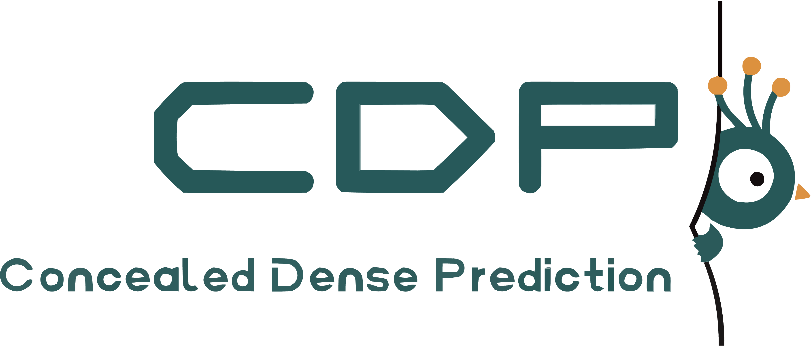
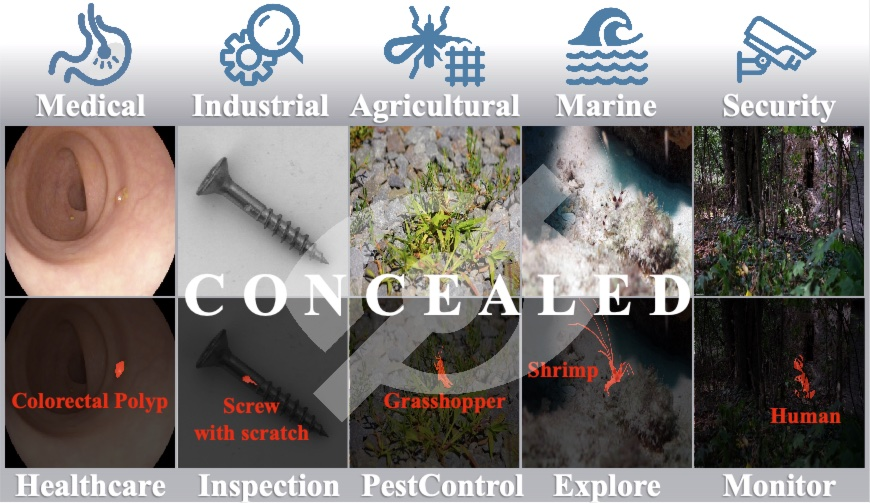
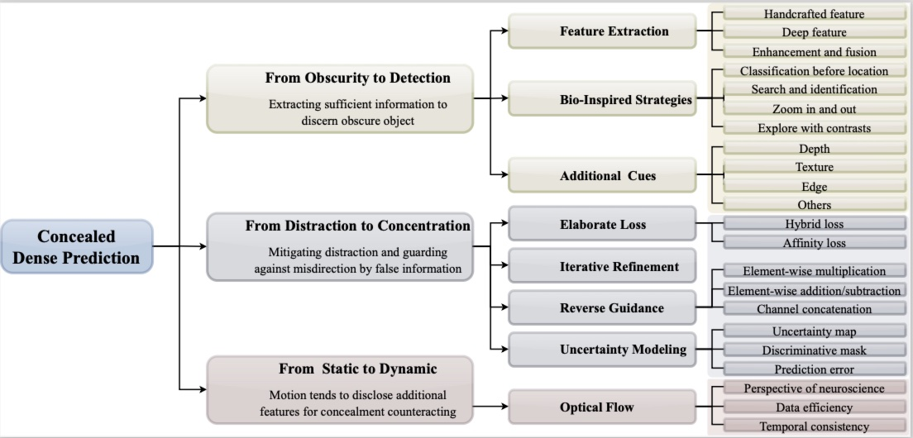
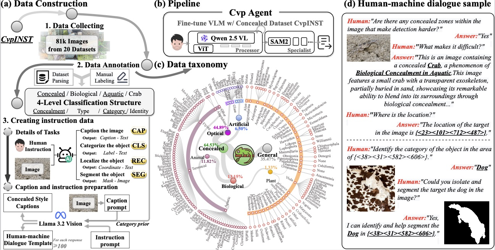

<!--  -->

		

Deep learning is developing rapidly and handling common computer vision tasks well. It is time to pay attention to more complex vision tasks, as model size, knowledge, and reasoning capabilities continue to improve. In this paper, we introduce and review a family of complex tasks, termed Concealed Dense Prediction (CDP), which has great value in agriculture, industry, etc. CDP’s intrinsic trait is that the targets are concealed in their surroundings, thus fully perceiving them requires fine-grained representations, prior knowledge, auxiliary reasoning, etc. The contributions of this review are three-fold: (i) We introduce the scope, characteristics, and challenges specific to CDP tasks and emphasize their essential differences from generic vision tasks. (ii) We develop a taxonomy based on concealment counteracting to summarize deep learning efforts in CDP through experiments on three tasks. We compare 25 state-of-the-art methods across 12 widely used concealed datasets. (iii) We discuss the potential applications of CDP in the large model era and summarize 6 potential research directions. We offer perspectives for the future development of CDP by constructing a large-scale multimodal instruction fine-tuning dataset, CvpINST, and a concealed visual perception agent, CvpAgent.
<!-- Abstract: Coming soon... -->

**Recommended citation:**

~~~
@misc{zhao2025deep,
    title={Deep Learning in Concealed Dense Prediction},
    author={Pancheng Zhao and Deng-Ping Fan and Shupeng Cheng and Salman Khan and Fahad Shahbaz Khan and David Clifton and Peng Xu and Jufeng Yang},
    year={2025},
    eprint={2504.10979},
    archivePrefix={arXiv},
    primaryClass={cs.CV}
}
~~~

