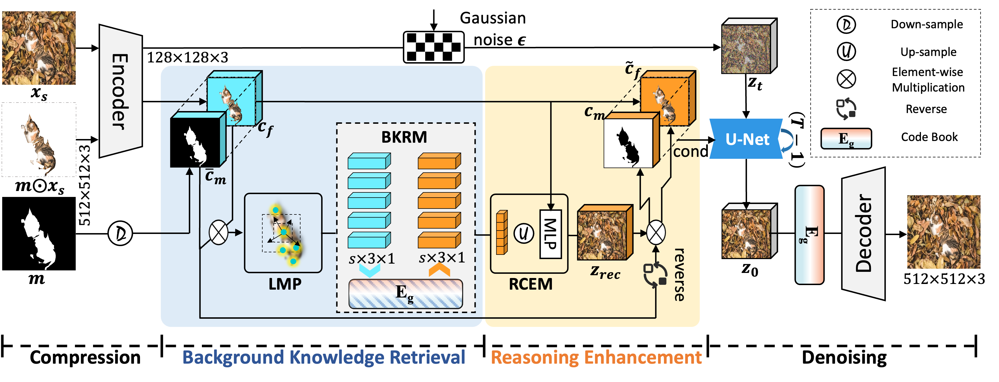

<!--  -->

		

Camouflaged vision perception is an important vision task with numerous practical applications. Due to the expensive collection and labeling costs, this community struggles with a major bottleneck that the species category of its datasets is limited to a small number of object species. However, the existing camouflaged generation methods require specifying the background manually, thus failing to extend the camouflaged sample diversity in a low-cost manner. In this paper, we propose a Latent Background Knowledge Retrieval-Augmented Diffusion (LAKE-RED) for camouflaged image generation. To our knowledge, our contributions mainly include: (1) For the first time, we propose a camouflaged generation paradigm that does not need to receive any background inputs. (2) Our LAKE-RED is the first knowledge retrieval-augmented method with interpretability for camouflaged generation, in which we propose an idea that knowledge retrieval and reasoning enhancement are separated explicitly, to alleviate the task-specific challenges. Moreover, our method is not restricted to specific foreground targets or backgrounds, offering a potential for extending camouflaged vision perception to more diverse domains. (3) Experimental results demonstrate that our method outperforms the existing approaches, generating more realistic camouflage images.
<!-- Abstract: Coming soon... -->

**Recommended citation:**

~~~
@inproceedings{zhao2024camouflaged,
  author = {Zhao, Pancheng and Xu, Peng and Qin, Pengda and Fan, Deng-Ping and Zhang, Zhicheng and Jia, Guoli and Zhou, Bowen and Yang, Jufeng},
  title = {LAKE-RED: Camouflaged Images Generation by Latent Background Knowledge Retrieval-Augmented Diffusion},
  booktitle = {Proceedings of the IEEE/CVF Conference on Computer Vision and Pattern Recognition (CVPR)},
  year = {2024},
}
~~~

